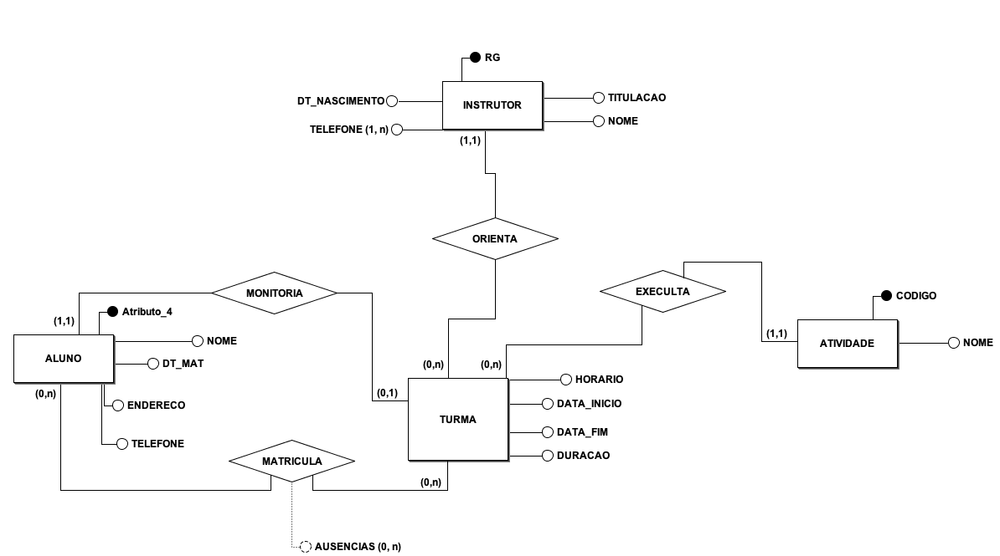

# BR_MODELO
Diagramas

# Diagrama Conceitual

# Uma academia de ginástica deseja manter um controle completo sobre o seu funcionamento.

# Os alunos são matriculados em turmas. Um aluno pode estar matriculado em várias turmas, caso deseje participar de diferentes atividades.

# Cada turma é responsável por executar um tipo específico de atividade e é orientada por um único instrutor. Um mesmo instrutor pode orientar várias turmas de diferentes atividades.

# Em cada turma existe também um aluno monitor, que auxilia o instrutor. Um mesmo aluno pode ser monitor de, no máximo, uma turma.

# Os dados cadastrados dos alunos incluem: código de matrícula, data de matrícula, nome, endereço e telefone.

# As informações sobre cada turma englobam: número de alunos, horário da aula, duração da aula, data inicial, data final e o tipo de atividade.

# Os dados dos instrutores cadastrados são: RG, nome, data de nascimento, titulação e todos os telefones possíveis para contato.

# Cada atividade possui um código e um nome.

# Para cada matrícula de um aluno em uma turma é mantido um registro das ausências desse aluno.

